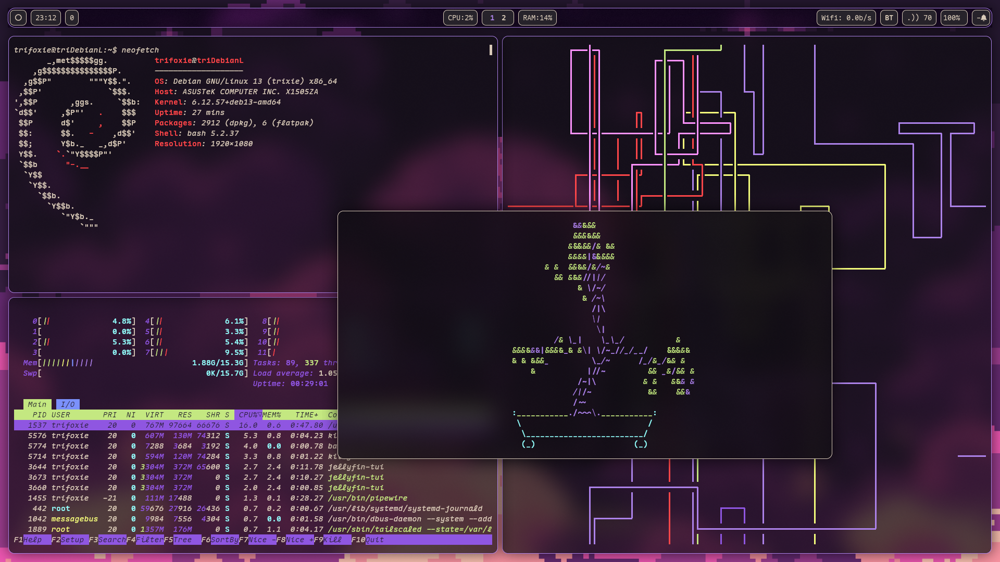

# Blackcurrant
*Config/Theme for SwayFX*

A purpley rice making use of SwayFX, waybar and wofi, the normal stuff.

## Screenshots



## Installation

### Dependencies
```
sway-fx
swaync
waybar
kitty
wofi
```

### Steps

Clone the repo: 
```bash
git clone https://github.com/trifoxie/sway-blackcurrant
```

Make backups (optional):
```
cp -r ~/.config/sway/ ~/.config_backup/sway_$(date + %Y%m%d)
cp -r ~/.config/swaync/ ~/.config_backup/swaync_$(date + %Y%m%d)
cp -r ~/.config/waybar/ ~/.config_backup/waybar_$(date + %Y%m%d)
cp -r ~/.config/kitty/ ~/.config_backup/kitty_$(date + %Y%m%d)
cp -r ~/.config/wofi/ ~/.config_backup/wofi_$(date + %Y%m%d)
```

Copy the contents into respective locations:
```bash
# Enter Directory
cd sway-blackcurrant

# Copy Configs
rsync -avP .config/ ~/.config/

# Copy Wallpaper
rsync -avP Pictures/ ~/Pictures/
```

## Credits
- Wallpaper (Pixel_Moon): Elizabeth-Bal (RedBubble)
- Ricing tutorial `:)`: Diinki [YT Video](https://www.youtube.com/watch?v=jFz5gLqv-FM)
